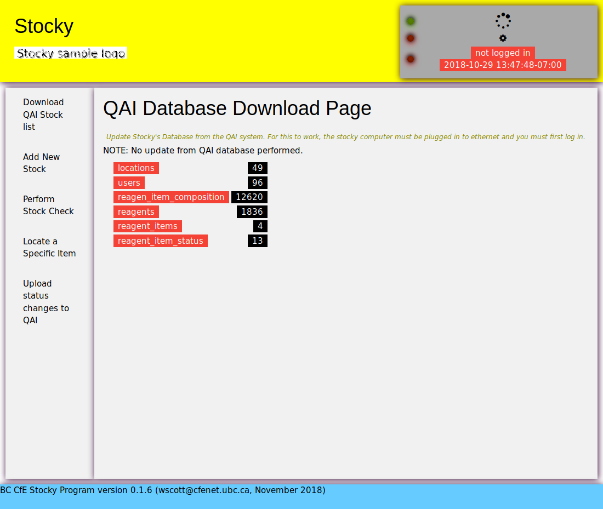

User Manual
***********

Background
==========

Test Results
============

this is where the test results should be:

.. test-results:: /stockysrc/goo.xml

just above this line		

General Work flow
=================

	    The Stocky application as it appears in the browser. The grey area in the top right
	    is the status bar. This has three status lights (green light = connection established, red light= connection is down). The top light shows the status of the connection between the browser and the stocky server on the laptop. **If this light is red, the stocky server is not working correctly**. The middle light shows the status of the RFID reader. This light should be green if you are using the RFID reader.
	    The bottom row shows whether stocky is logged in to QAI or not,
	    and the last time that the stocky database was downloaded from the QAI database.
	    Depending on what stock-taking operations you are performing, you do not need to
	    be connected to QAI.

.. uml::
   
   @startuml
   actor user
   database Stocky
   database QAI

   user   -> QAI : Enter New Stock (online)
   Stocky  <- QAI : Download database
   user  --> Stocky : Perform Stock Check (offline)
   Stocky -> QAI : Upload changes
   user  --> Stocky : Search for Stock Item (offline)
   @enduml

For security reasons, the laboratory's QAI system cannot be accessed over the Wifi network.
QAI can only be accessed from machines that are plugged in over the wired ethernet network.
Checking stock at a certain location requires the stocky laptop to be mobile, which means
that stocky cannot have access to QAI when undertaking this function.
For this reason, Stocky has been designed to work independently from QAI when
checking stock is being performed.
Look at section :ref:`checkstock`
   
Entering New Stock
==================
In order to perform this step,
 1. Attach an RFID label to each new stock item you want to enter.

 2. Check that the RFID reader is connected by Bluetooth (paired) to the stocky laptop. This
    is indicated by the Bluetooth icon on the screen (top left) showing in blue.

 3. Open the browser on the laptop (it should be pointing to http://localhost:5000) and
    log in to QAI by clicking on the 'not logged in' field in the status bar.
    
 4. Using the menu bar on the left, navigate to
    the 'Add New Stock' page. You will be presented with
    an as yet empty table of RFID tags numbers.
 5. Use the RFID reader to scan RFID labels into the table.
    
    .. note::
       You can do this using the RFID reader in one of two ways:
          a. Scan the **RFID label** by pulling the reader trigger once.
	     This method is useful if you are entering multiple items at once, but it
	     might pick up labels of items you do not wish to enter as new items.
	  b. Scan the **bar code** by pulling the reader trigger twice. Stay on the trigger
	     after the second time. The red scan-line will appear until the reader has
	     recognised a bar code.
	     This method is useful when you want to scan a small number of targeted labels
	     without interference.
 6. Once you have a number of RFID labels present in the table, you can enter them into QAI.
   
   .. note::
      Depending on how you scanned the labels (by RFID or bar code), there might be entries
      in the table you do not wish to enter. Simply click on the Selected? column
      of the item you do not wish to enter to QAI.

      .. figure:: stocky-screenshot-addstock01.png
	:scale: 65 %

	Adding three reagent items to QAI at 647 Powell St. Item number CHEM10004 was scanned
	but will not be added.

   .. tip::
      You can optionally choose a location for the new items on the stocky page before clicking
      on 'Add to QAI'.
      If all, or most, of the new items are to be located **at the same place**, then it is faster
      to select this location on the stocky web page before entering them on the QAI.
      The location for individual items can still be overridden on the QAI page.
      You can also leave the location as 'undefined' on the stocky page, in which case the
      location of every items must be entered on the QAI page.

   Clicking on the 'Add to QAI' button at the bottom of the table will open a new
   browser tab on the QAI website with the fields partially filled in
   (see the Figure below). Complete the required fields for each item on the QAI web page.

   .. _qaipic:
   .. figure:: stocky-screenshot-addstockQAI01.png
	      :scale: 50%
		
	      The QAI screen for adding new reagent items. On this screen, eight items were
	      previously scanned in stocky.

.. _checkstock:

Checking Stock Locations
========================

.. important::
   Checking stock entails comparing items scanned in actual fact against what is known about
   an item in a database. Inconsistencies are then sent back to the QAI after inventory.
   It is important that the stocky database is updated from QAI **immediatley before** stock
   is checked, because otherwise stock taking will be based
   on outdated information.

1. Before performing a stock inventory, connect the stocky laptop to ethernet.
   You do not need the RFID reader for this step.
2. Log in to QAI on the Stocky webpage, and Download the QAI Stock list.

3. The laptop can now be switched off, removed from the ethernet and taken with the RFID
   reader to the location at which stock is to be checked.

Updating QAI from Stocky
========================

